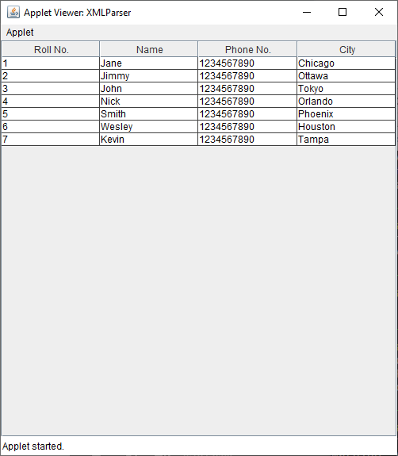

# Xml Parser

**Version 1.0.0** 

Implementation of an XML Parser uing JApplet and displaying the details of this XML document in a tabular format using Java Swing Components.

**NOTE: Jave 9 should be used in order to execute the program as we are using an Applet.**

## Installation 

Installation of JDK 9 is a pre-requisite. 

* Steps to follow: -
    * https://docs.oracle.com/javase/9/install/installation-jdk-and-jre-microsoft-windows-platforms.htm#JSJIG-GUID-371F38CC-248F-49EC-BB9C-C37FC89E52A0

## FAQ

#### How to run Java Applet if I have already installed higher version of Java (above JDK 9)?

* Steps to follow: -
    * https://www.browzzweb.com/2020/04/how-to-run-java-applet-program.html#:~:text=Compile%20the%20program%20in%20your%20terminal%20using%20javacold%20command.&text=After%20compilation%20you%20will%20get,applet%20using%20the%20command%20appletviewer.&text=Now%20you%20can%20see%20the%20Hello%20world%20applet%20running.

  
## Deployment

To deploy this project on a machine with higher version of JDK and JDK 9. 

```bash
  javacold XMLParser.java
```
Followed by

```bash
  appletviewer XMLParser.java
```

  
## Screenshots



## Tech Stack

**Used:** Java

**Toolkits:** AWT, Swing
  
## Lessons Learned

With the help of this project, I understood the working of an XML Parser. I understood how process of reading an XML document and providing an interface to the user application for accessing the document works.


## Authors

- [@Sahethi](https://www.github.com/Sahethi)

## License

[MIT](https://choosealicense.com/licenses/mit/)
## Documentation

[Documentation](https://linktodocumentation)

